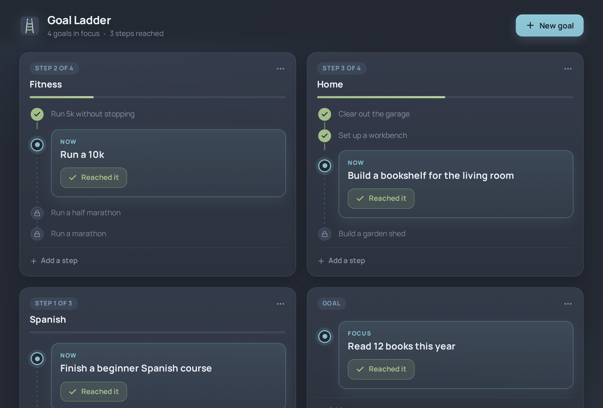

# Goal Ladder

A small desktop app for goals that lead to other goals. You write down what you are working toward, and if it leads somewhere, you add what comes after it. Only the next step is in focus. Everything further up the ladder stays visible but locked until you get there.

It has no dates, no reminders and no accounts. Your goals are kept in one file on your own machine.



## How it works

A ladder is a list of steps in order. For example:

> Run 5k without stopping, then Run a 10k, then Run a half marathon, then Run a marathon

The first step you have not reached yet is the focus. It is shown large, with a **Reached it** button. Steps you have reached get a green tick. Steps after the focus show a padlock and stay greyed out until the one before them is done.

A ladder can be a single step if you just want a plain goal. Ladders can have an optional name (Fitness, Work, Home) and you can add more steps to the top of any ladder whenever you like, including one you have already finished.

- **New goal** (or Ctrl+N) opens the editor. Press Enter to add the next step and Ctrl+Enter to save. You can also type a whole ladder on one line, like `Run 5k -> Run 10k -> Half marathon`, and it is split into steps for you.
- **Reached it** moves the ladder up a step and unlocks the next one. Undo is on the toast that appears, or on the last ticked step if you hover it.
- **Add a step** at the bottom of each card adds a new step to the top of that ladder.
- The **...** menu on each card lets you edit steps, reorder ladders, or delete one.
- Finished ladders move into a Completed section at the bottom.
- Long ladders scroll inside their card, and the card keeps the step you are on in view.

## Installing

Grab the latest build from the [Releases](https://github.com/WyldVeil/GoalLadder/releases) page.

| Platform | File |
|---|---|
| Windows 10/11 | `GoalLadder_x.y.z_x64-setup.exe` (installer) or `GoalLadder_x.y.z_x64_en-US.msi` |
| Debian / Ubuntu / Mint | `GoalLadder_x.y.z_amd64.deb`, then `sudo apt install ./GoalLadder_x.y.z_amd64.deb` |
| Fedora / openSUSE | `GoalLadder-x.y.z-1.x86_64.rpm` |
| Arch / Manjaro / EndeavourOS | `goalladder-bin-x.y.z-1-x86_64.pkg.tar.zst`, then `sudo pacman -U <file>` |
| Any Linux, by hand | `GoalLadder-x.y.z-linux-x86_64.tar.gz` |

Linux needs `webkit2gtk-4.1`; the deb, rpm and Arch packages pull it in.

## Where your data lives

On Linux everything is stored in `~/.local/share/com.wyldveil.goalladder/goals.json`, and on Windows in `%APPDATA%\com.wyldveil.goalladder\goals.json`. Each save is written to a temporary file first and then moved into place, and the previous version is kept as `goals.json.bak`. It is plain JSON, so you can back it up or edit it by hand.

## Building

You need Rust, Node.js, and the WebKitGTK 4.1 development files (`webkit2gtk-4.1` on Arch).

```sh
npm ci
npx tauri build --no-bundle
```

The binary ends up at `src-tauri/target/release/goalladder`.

`npx tauri build` on its own makes the Windows installers on Windows, or the .deb and .rpm on Linux.

On Arch, `./build.sh` builds the binary, packs it into the release tarball, and makes a pacman package from `packaging/arch/PKGBUILD`. `./build.sh --install` installs it as well.

## Built with

Tauri 2, React and TypeScript. The colours are from the [Nord](https://www.nordtheme.com/) palette and the typeface is Manrope.

## License

MIT
